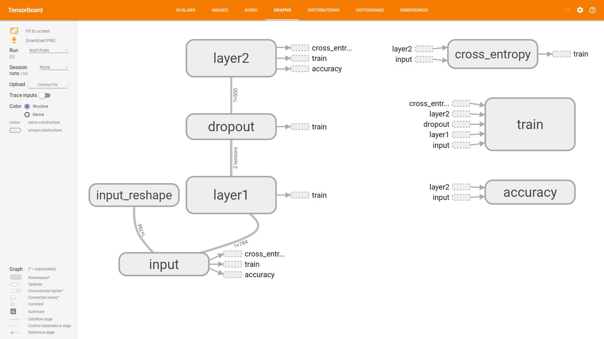

# DL-notes
## 深度学习之从入门到放弃

我最近在学习深度学习，这里是我的一些心得笔记啥的，因为自己比较懒，有些复杂的东西不想整理，这里可能就比较杂的放一些东西。

### [前往个人主页](http://mcoder.cc)

## 作者说明
- 河海大学物联网应用与技术研究生
- 联系方式： email: `mcoder2014@sina.com`
- CSDN博客: [ChaoQun](http://blog.csdn.net/jcq521045349)
- 个人主页: [Mcoder.cc](http://mcoder.cc)

# 基础知识
学习深度学习，首先我们需要对深度学习有一定的了解，这里比较公认的是[斯坦福大学吴恩达教授的机器学习课程](https://www.coursera.org/learn/machine-learning)。深度学习(`deep learning`)是机器学习拉出来的分支，目前广泛使用`TensorFlow`库进行开发学习。所以，学习深度学习最好需要学习一下`TensorFlow`，可以做到事半功倍。

`TensorFlow`最好安装在Linux系统下，而我们对linux操作不熟悉的怎么办呢？？

**当！然！是！去！学！呀！不！然！呢！**

这里我整理一些可能会比较好用的[linux上的命令、软件啥的](posts/linux_tips.md)，希望能给大家带来一些比较不错的使用体验。

## 卷积神经网络
我最近研究的问题是与[卷积神经网络](posts/Convolutional_neural_network.md)相关的，所以我看完了机器学习课程后首先看的就是深度学习中和卷积神经网络相关的部分，主要看卷积神经网络的结构和一些经典的综述性文章。比如英文在线电子书[Deep Learning](http://www.deeplearningbook.org/)中第九章[Convolutional Networks](http://www.deeplearningbook.org/contents/convnets.html)，这本书也有对应的[中文版电子书](https://github.com/exacity/deeplearningbook-chinese)，同时，他的纸质版在[京东](https://item.jd.com/12128543.html)发售，价格昂贵，暂时还没舍得买。

这里是我对论文[Jackson A S, Bulat A, Argyriou V, et al. Large Pose 3D Face Reconstruction from a Single Image via Direct Volumetric CNN Regression[J]. 2017. ](https://arxiv.org/abs/1703.07834) 的一点点理解[笔记](posts/Large_pose_3d_face_reconstruction.md)

这里放一张不太深的卷积网络截图

## TensorFlow
在介绍学习[TensorFlow](https://www.tensorflow.org/?hl=zh-cn)之前我们肯定要先会使用Python。我发现了一个[Python入门指南](http://www.pythondoc.com/pythontutorial3/index.html)，内容很是详细，有编程基础的人，照着走一遍流程，不到两天就能学完（从下午到晚上，看到了第九章）。同样，这个也有英文原版，英语比较好的建议直接阅读[原版](https://docs.python.org/3.6/tutorial/index.html)。我为了自己能看的快一些，所以直接看的中文版。

之后才是正式的开始学习TensorFlow，TensorFlow也是有自己的入门教程---[Getting Started With TensorFlow](https://www.tensorflow.org/get_started/get_started?hl=zh-cn)，据说写得还不错，也提供了数据集供你学习使用。

## Tensorboard
`Tensorboard`是`TensorFlow`的很强大的可视工具，对于我们学习理解一个算法，或是进行`Debug`排查错误，都非常的有帮助，并且，它显示的画面非常炫酷，让我和身边学习机器学习的人都表示震惊。这个工具，越早接触越好！

这里放一张截图

# 索引

这个索引按照我以为的应该`step by step`的顺序来排列

- [Linux Tips](posts/linux_tips.md)
- [Python Tips](posts/Python_tips.md)
- [My Python Tips](posts/python_tips2.md)
- [TensorFlow Tips](posts/TensorFlow入门.md)
- [Tensorboard Tips](posts/Tensorboard_Tips.md)
- [MNIST Deep 梳理下数据流](/posts/Mnist_deep.md)
- [Graph Visualizing Understanding](posts/Tensorflow_get_atarted_graph_visualization.md)
- [尝试理解 Tensor](posts/try_to_understand_tensor.md)
- [尝试理解 Shape](posts/try_to_understand_shape.md)
- [Variable](posts/try_to_understand_variables.md)
- [尝试理解 Graph](posts/try_to_understand_graph_session.md)
- [保存模型](posts/saving_and_restoring.md)
- [完整的 Tensorflow 训练流程](posts/TensorFlow_program.md)
- [TensorFlow 常见问题](posts/tensorflow_FAQ.md)
- [CNN 卷积神经网络](posts/Convolutional_neural_network.md)
- [什么是 Batch Normalization](posts/batch_normalization.md)
- [Activation Function](posts/activation_function.md)
- [人脸重建算法笔记](posts/Large_pose_3d_face_reconstruction.md)
