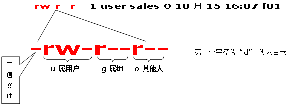

# linux相关的笔记

### [回首页](README.md)

使用linux，肯定要多使用linux的`terminal`终端。而且很多时候使用`TensorFlow`都是搭建了一个GPU服务器供多个开发者共同使用，所以SSH远程连接过去更是常有的事，所以必须强迫自己学会应付没有显示界面的操作系统。

这里有一个比较不错的网站，叫做[Linux命令大全](http://man.linuxde.net/) 我也是写这篇文章时刚刚看到，那么文章中我想提到的命令，就不详细解释了，直接附一个帮助链接就足够了。

## SSH远程
配置linux服务器SSH远程访问的服务可以参考这篇博客:[如何在Ubuntu上开启SSH服务](http://blog.csdn.net/md521/article/details/52597398)。
### Pytty
### xShell

## 文件
### cd
### ll
### ls
### df
### mkdir
### rm

### 修改文件权限 chmod
有的时候本地普通用户没有文件管理的权限，我们需要修改文件的使用权限。在UNIX系统家族里，文件或目录权限的控制分别以读取、写入、执行3种一般权限来区分，另有3种特殊权限可供运用。用户可以使用chmod指令去变更文件与目录的权限，设置方式采用文字或数字代号皆可。


``` shell
chmod(选项)(参数)

-c或——changes：效果类似“-v”参数，但仅回报更改的部分；
-f或--quiet或——silent：不显示错误信息；
-R或——recursive：递归处理，将指令目录下的所有文件及子目录一并处理；
-v或——verbose：显示指令执行过程；
--reference=<参考文件或目录>：把指定文件或目录的所属群组全部设成和参考文件或目录的所属群组相同；
<权限范围>+<权限设置>：开启权限范围的文件或目录的该选项权限设置；
<权限范围>-<权限设置>：关闭权限范围的文件或目录的该选项权限设置；
<权限范围>=<权限设置>：指定权限范围的文件或目录的该选项权限设置；

chmod u+x,g+w f01　　//为文件f01设置自己可以执行，组员可以写入的权限
chmod u=rwx,g=rw,o=r f01
chmod 764 f01
chmod a+x f01　　//对文件f01的u,g,o都设置可执行属性

来自: http://man.linuxde.net/chmod
```

## 任务管理器
### top
### htop
相较top命令，htop有更清晰明了的显示。[安装](https://www.zhihu.com/question/20167594/answer/25812005)起来也很简便。


## 文件传输
### ftp
### lrzsz
当在windows系统下使用xShell工具远程连接linux服务器时，lrzsz工具包可以比较方便的在服务器和本地之间传输文件，使用ssh协议。本地向服务器传文件是`rz`，然后会有文件选择工具出现。服务器向本地传输文件是`sz 文件名`，然后会让你选择本地保存路径。


### [回首页](README.md)
