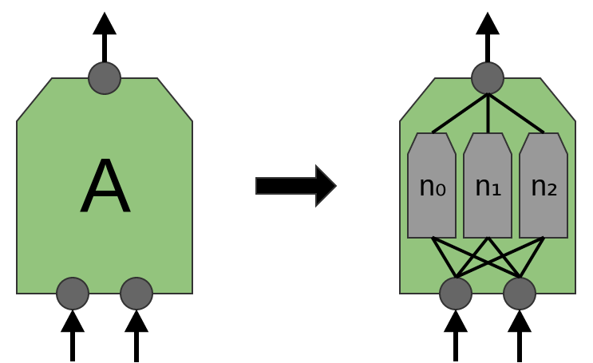
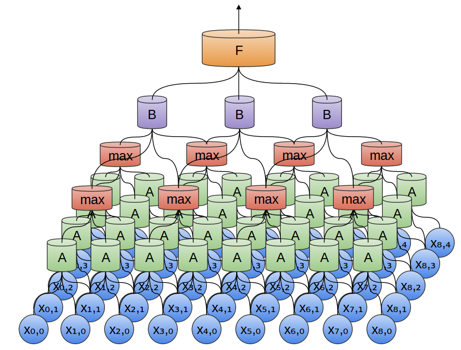

# 卷积神经网络`(CNN)`

## [回首页](../README.md)

我最近研究的问题是与[卷积神经网络](Convolutional_neural_network.md)相关的，所以我看完了机器学习课程后首先看的就是深度学习中和卷积神经网络相关的部分，主要看卷积神经网络的结构和一些经典的综述性文章。比如英文在线电子书[Deep Learning](http://www.deeplearningbook.org/)中第九章[Convolutional Networks](http://www.deeplearningbook.org/contents/convnets.html)，这本书也有对应的[中文版电子书](https://github.com/exacity/deeplearningbook-chinese)，同时，他的纸质版在[京东](https://item.jd.com/12128543.html)发售，价格昂贵，暂时还没舍得买。

# 定义

卷积神经网络（`Convolutional Neural Network, CNN or ConvNet`）是一种前馈神经网络，它的人工神经元可以响应一部分覆盖范围内的周围单元，对于大型图像处理有出色表现。

卷积神经网路由一个或多个卷积层和顶端的全连通层（对应经典的神经网路）组成，同时也包括关联权重和池化层（`pooling layer`）。这一结构使得卷积神经网路能够利用输入数据的二维结构。与其他深度学习结构相比，卷积神经网路在图像和语音识别方面能够给出更好的结果。这一模型也可以使用反向传播算法进行训练。相比较其他深度、前馈神经网路，卷积神经网路需要考量的参数更少，使之成为一种颇具吸引力的深度学习结构。

# 结构

一个卷积神经网络包含一个输入层、一个输出层和多个隐含层。一个典型的CNN包含 卷积层(`convolutional layers`)、池化层(`pooling layer`)、(`fully connected layers`) 和 (`normalization layers`)。

## Input layer

输入层

## Convolutional layer

卷积层

如图所示，`A`层便是一层卷积层。

在传统卷积网络中，A就是一些相同类型的神经元，他们获得相同类型的数据，检测不同的特征，比如一个获得两个数据的卷积神经元如下：

有的时候，A也可以是一些比较复杂的结构，然后给出一个抽象的接口。 

## Pooling layer

池化层

卷积层总是伴随着池化层，比较流行的的是最大池化层(`max=pooling layer`)。最大池化层取几个小的特征的最大值作为自己的输出，从而将很大量的数据缩小规模。

## ReLU layer

Rectified Linear Units layer 线性整流层

## Fully connected layer

全连接层

## Loss layer

损失函数层

# 运行流程

循环迭代:

1. `Sample` 输入一小批数据;
2. `Forward` 向前推进这个模型，计算`Loss`;
3. `Backprop` 反向传播算法，计算梯度;
4. `Update` 利用计算的梯度值，更新参数。

## Dropout
Dropout提供了正则化一大类模型的方法，计算方便但功能强大。

# Reference

- [Conv Nets: A Modular Perspective](http://colah.github.io/posts/2014-07-Conv-Nets-Modular/)
- [Understanding Convolutions](http://colah.github.io/posts/2014-07-Understanding-Convolutions/)
- [Chapter 9: Convolutional Networks](http://www.deeplearningbook.org/contents/convnets.html)

  ### [回首页](../README.md)
