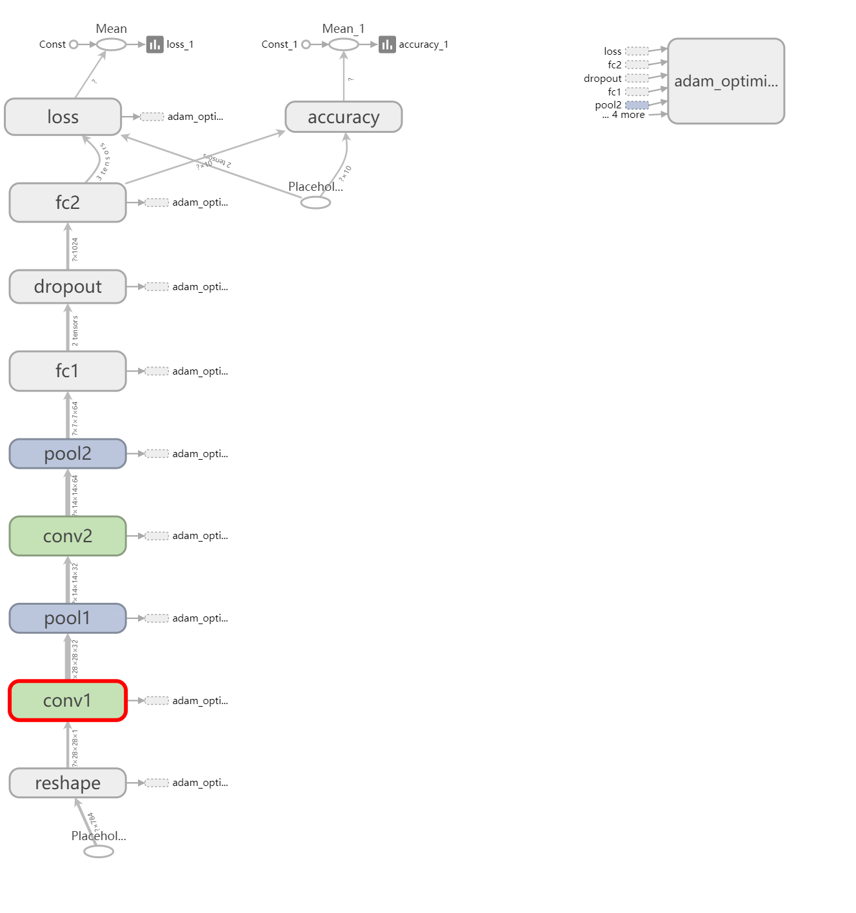
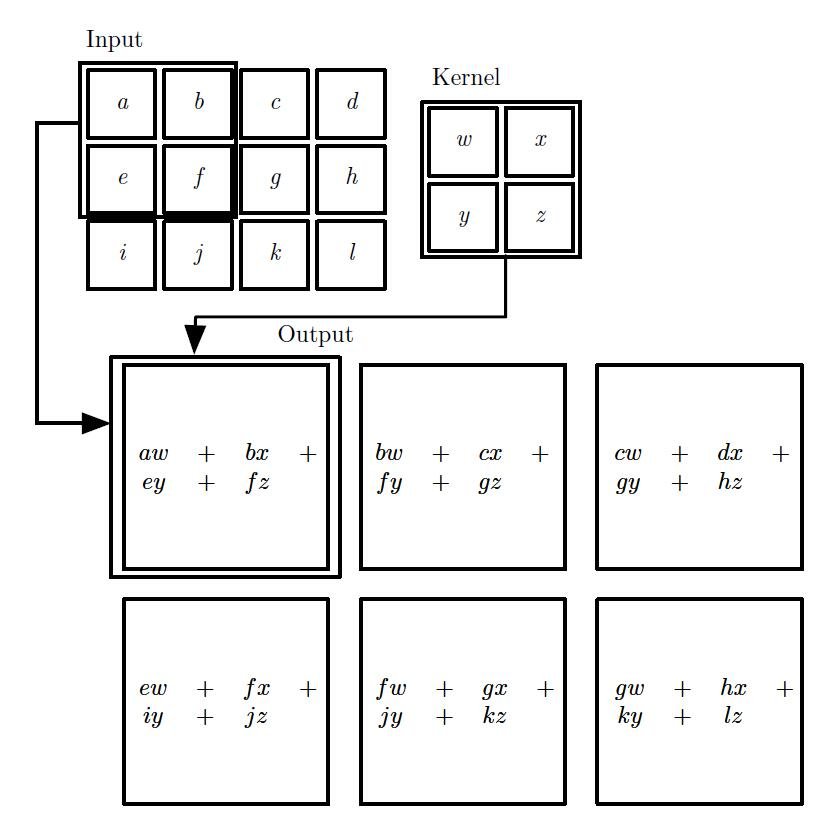
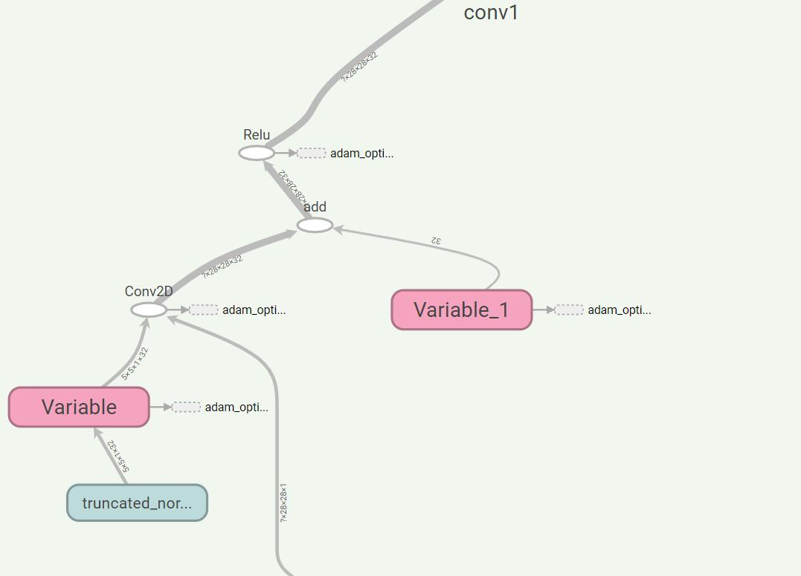
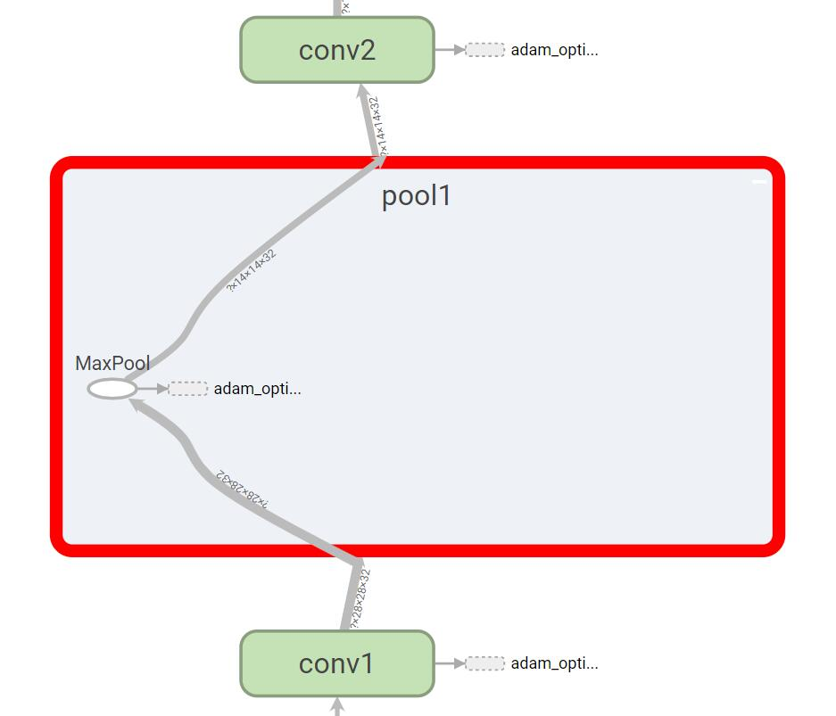
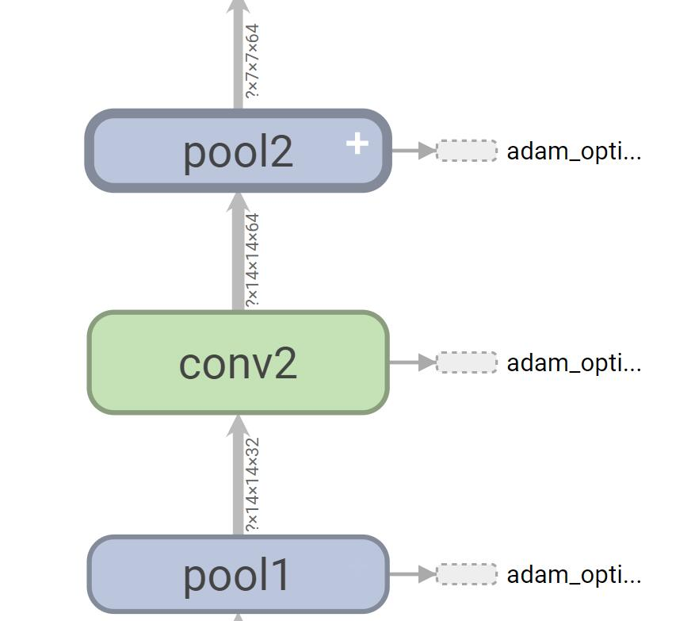

# Mnist Deep 经过卷积后数据大小的变化的理解

### [回首页](../README.md)

首先我们可以看到，`MNIST_deep` 这个模型的结构如图所示



但，我对卷积不是很理解这个概念，就一起来理一下。

# 卷积运算

这是一个2 维卷积的例子（没有对核进行翻转）。我们限制只对核完全处在图像中的位置进行
输出，在一些上下文中称为“有效’’ 卷积。我们用画有箭头的盒子来说明输出张量的左上角元素是
如何通过对输入张量相应的左上角区域应用核进行卷积得到的。

这是一个典型的卷积计算的过程，输入数据大小为[4, 3]，卷积核大小为[2, 2]，每次移动的一个单位间隔，计算出的结果的数据大小为 [3, 2]。这个我对卷积过程的一个初步的理解，这样运算后，输入输出的大小不相同。

# Deep MNIST

## PlaceHolder
```python
x = tf.placeholder(tf.float32, shape=[None, 784])
y_ = tf.placeholder(tf.float32, shape=[None, 10])
```
输入是个 X ，28x28 的黑白图像，输出是 y_ ，10 个数字表示类别。None 表示并不知道一批训练多少个数据。

对于 shape 形状的理解，可以看看我总结的其他文章 [ Tensor ]( try_to_understand_tensor.md )、[ Shape ]( try_to_understand_shape.md )。

## Weight Initialization

``` python
def weight_variable(shape):
  initial = tf.truncated_normal(shape, stddev=0.1)
  return tf.Variable(initial)

def bias_variable(shape):
  initial = tf.constant(0.1, shape=shape)
  return tf.Variable(initial)
```
这两个函数是为了根据输入的shape初始化出 `weight` 和 `bias`

## Convolutional and pooling

```python
def conv2d(x, W):
  return tf.nn.conv2d(x, W, strides=[1, 1, 1, 1], padding='SAME')

def max_pool_2x2(x):
  return tf.nn.max_pool(x, ksize=[1, 2, 2, 1],
                        strides=[1, 2, 2, 1], padding='SAME')
```
第一个是根据输入进来的 W（卷积核的变量）来生成一层卷积层，第二个是加一层 最大池化层。这里最大池化层的大小是2 x 2， 即四个值取一个最大值保留下来。

>ksize: A list of ints that has length >= 4. The size of the window for each dimension of the input tensor.

padding 输入是字符串 'SAME' 或 'VALID'， SAME 是经过之后，输出的大小与输入大小相同。 VALID 则是真正的大小。（暂时这么理解吧……）

# 模型
首先对数据进行 `reshape`操作，让他再变成二维的图像。
```python
x_image = tf.reshape(x, [-1, 28, 28, 1])
```

## 第一层网络

```python
W_conv1 = weight_variable([5, 5, 1, 32])
b_conv1 = bias_variable([32])

h_conv1 = tf.nn.relu(conv2d(x_image, W_conv1) + b_conv1)
h_pool1 = max_pool_2x2(h_conv1)
```

即第一层有32个卷积核，每个卷积核大小是 `5 x 5 x 1` ，而输出的数据的大小是 `28 x 28 x 1`，经过处理之后，输出的大小应该是 `28 x 28 x 32` 。然后经过卷积层 `h_pool1` ，因为池化层的大小是 `2 x 2`， 所以输出的是 `14 x 14 x32` ， 前两个维度直接减小一半。




## 第二层网络

```python
W_conv2 = weight_variable([5, 5, 32, 64])
b_conv2 = bias_variable([64])

h_conv2 = tf.nn.relu(conv2d(h_pool1, W_conv2) + b_conv2)
h_pool2 = max_pool_2x2(h_conv2)
```

因为第二层输入数据大小为 `14 x 14 x 32`， 所以第二层定义的64个卷积，每个卷积核大小为`5 x 5 x 32`，与输入结果对应，则经过卷积层输出为 `14 x 14 x 64`。经过池化层后，大小为 `7 x 7 x 64`。



## 稠密连接层

```python
W_fc1 = weight_variable([7 * 7 * 64, 1024])
b_fc1 = bias_variable([1024])

h_pool2_flat = tf.reshape(h_pool2, [-1, 7*7*64])
h_fc1 = tf.nn.relu(tf.matmul(h_pool2_flat, W_fc1) + b_fc1)
```

因为图像的尺寸已经非常小了，再用卷积就不太合适了，这里将卷积和 1024 个节点相连。然后再使用 ReLU 操作过滤，输出的大小应该是一维向量 1024。

## Dropout
为了防止过拟合，在训练时随机舍弃一些节点，叫 `dropout`操作。
```python
keep_prob = tf.placeholder(tf.float32)
h_fc1_drop = tf.nn.dropout(h_fc1, keep_prob)
```

## Readout

这是最后一层，为了输出结果。
```python
W_fc2 = weight_variable([1024, 10])
b_fc2 = bias_variable([10])

y_conv = tf.matmul(h_fc1_drop, W_fc2) + b_fc2
```
这层使用 softmax regression 将最终结果输出。

### [回首页](../README.md)
