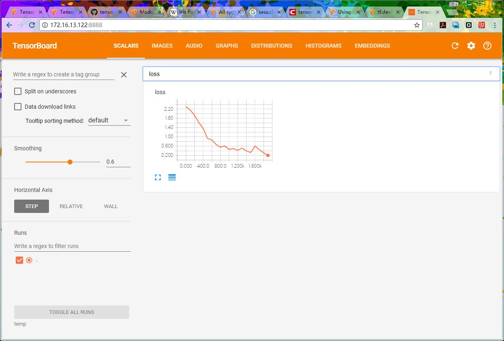

# Tensorboard tips

### [回首页](../README.md)

`Tensorboard` 是这样一个工具，可以将机器学习的结果显示在网页上，图文并茂，让你能清晰的看到训练的趋势，或者说，能截图，能用来做文章的插图。

`Tensorboard` 通过读取`TensorFlow`运行时产生的的包含`summary data`的log文件来生成页面。

# tf.summary
支持的 summary ops 包括；
- tf.summary.scalar     # 折线图
- tf.summary.image  
- tf.summary.audio
- tf.summary.text
- tf.summary.histogram  # 柱状图

当你使用某种`summary ops`时，你需要给出一个`tag`，这个`tag`就是这个`op`记录下的数据的名称，会显示在`tensorboard`上。`scalar`和`histogram` 面板通过tag组织数据，并且将数据分成组，同故宫一个像目录一样的命名结构`/like/hierarchy`，如果你有很多tags，建议你将他们分成组来管理。

### [回首页](../README.md)
