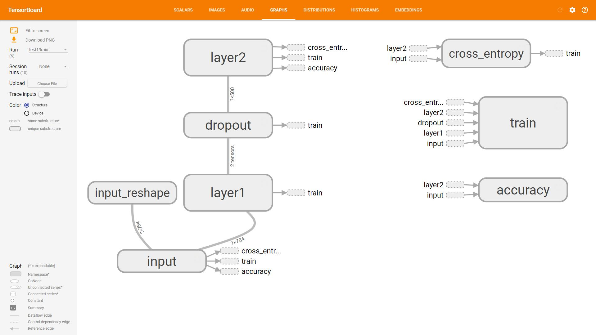

# Tensorboard tips

### [回首页](../README.md)

`Tensorboard` 是这样一个工具，可以将机器学习的结果显示在网页上，图文并茂，让你能清晰的看到训练的趋势，或者说，能用来做文章、报告、PPT的插图。并且可以帮助你分析自己的模型（这才是本来的目的）理解模型的训练速度，优缺点啥的。`Tensorboard`还可以将不同训练模型显示在一张图表上进行比较，让你充分的理解哪一个模型更加优秀，方便自己改进模型。

`Tensorboard` 通过读取`TensorFlow`运行时产生的的包含`summary data`的log文件来生成页面。

这里有一个[谷歌2017TensorFlow大会上介绍Tensorboard的一段演讲](https://github.com/dandelionmane/tf-dev-summit-tensorboard-tutorial)，这段20多分钟的视频都是 **干货** ，建议看一下。这段视频原本放在YouTube上，不过[B站](https://www.bilibili.com/video/av12548529)啥都有系列，你现在可以在B站上看到这个视频。。。

**很NICE！对不对！**

# tf.summary
支持的 summary ops 包括；
- tf.summary.scalar     # 标量
- tf.summary.image      # 图像信息
- tf.summary.audio      # 音频信息
- tf.summary.text
- tf.summary.histogram  

他可以通过记录`graph`之中的Tensor，来记录数据，但目前并不支持那么多。

当你使用某种`summary ops`时，你需要给出一个`tag`，这个`tag`就是这个`op`记录下的数据的名称，会显示在`tensorboard`上。`scalar`和`histogram` 面板通过tag组织数据，并且将数据分成组，同故宫一个像目录一样的命名结构`/like/hierarchy`，如果你有很多tags，建议你将他们分成组来管理。

## scalar

## image 二维图像

## graph 模型信息

并且，可以选择吧一些不重要的节点放在右侧，可以手动调整，特别酷！！

## histogram

# 使用 Tensorboard

这里，`TensorFlow`官方也给出了教程，我就不嫌丑了。[Visualizing Learning](https://www.tensorflow.org/get_started/summaries_and_tensorboard?hl=zh-cn)、[Graph Visualization](https://www.tensorflow.org/get_started/graph_viz?hl=zh-cn)都是官方很优秀的教程。

对其中的例子，我做了一点[自己的分析、梳理](Tensorflow_get_atarted_graph_visualization.md)。做的很简陋，因为自己理解了的东西，就有点懒惰，不想写一大堆进行解释，而自己没理解的东西也写不了多少……就酱……

### [回首页](../README.md)
