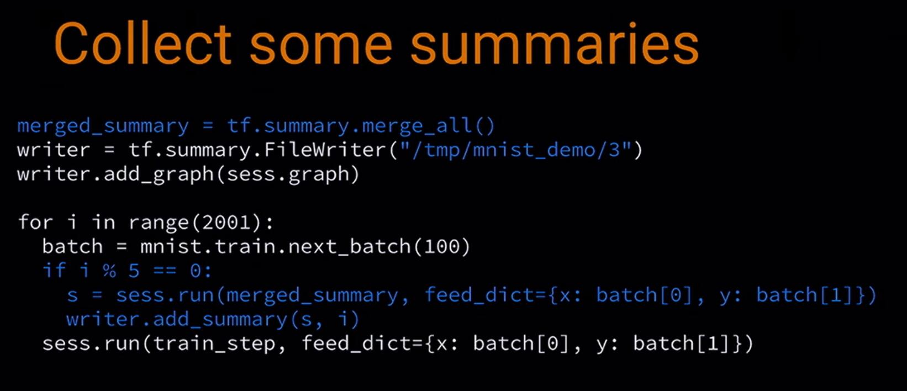

# 对 Graph Visualization 的梳理

### [回首页](../README.md)

我们已经知道`Tensorboard` 可以将机器学习的数据、图等可视化表示，但具体怎么做？Tensorflow有给出教程。我想顺着这个示例代码梳理一下一个比较完整的tensorflow程序具有的几部分。

# 流程

1. 导入数据;
2. 新建了一个Session;
3. 利用一些函数，建立了一个CNN模型。在建立模型的时候，就指定了summary记录的数据。
4. 设置一些输出的参数变量。
5. 设置log输出路径等信息。
6. 迭代进行训练。训练时根据需要输出summary信息。

# 关于图的名称路径的问题

从图中我们能够看到，图按照名称分为不同的文件夹，不同的文件夹下面又可以存放不同的图。这个是通过`tf.name_scope`来规划实现的。因此，我们在输出图之前，最好先进行合理的规划分类。

同时，左上角也支持 **创建新的floder** 你可以输入关键字，将相关的图标显示在一栏中，这个关键字支持正则表达式。

# 仅输出 graph 信息


`TensorFlow` 还可以把模型的Graph数出来，这样我们可以在真正的训练模型之前，先验证下模型的路线是否符合自己的心意，然后才开始读取数据，进行训练。

我写了一个脚本来测试输出这个图，可以成功输出，重要的有几点：
1. 使用`tf.name_scope`合理地对图进行整理，对重要的节点基于一级分类，对于不够重要的节点，将其隐藏在二级、三级目录以下。你将图用`name scope`整理的越合乎逻辑，你能看到的可视化效果越好。

  > 你使用的`TensorFlow`的图可能有数以千计的节点数量，如果把所有的节点都平铺显示出来，那么你可能根本理不清之间的关系。你可以使用`variable names`来作为可视化划分层次的工具。默认情况只会显示最顶层的层次。这里就是一个使用`hidden`的 `tf.name_scope`：

  ```python
  import tensorflow as tf

  with tf.name_scope('hidden') as scope:
      a = tf.constant(5, name='alpha')
      W = tf.Variable(tf.random_uniform([1, 2], -1.0, 1.0), name='weights')
      b = tf.Variable(tf.zeros([1]), name='biases')
  ```
  从而，这些参数的名称变成:
  - hidden/alpha
  - hidden/weights
  - hidden/biases

  而默认情况下，这些分支会被显示为一个`hidden`节点，只有点击'+'号才会全部显示出来。

2. 先创建`Session`，之后将`Session`初始化，然后就可以将图输出。 `sess.graph` 提供了查看 `tf.Session` 使用的图的功能。但如果你使用高 `API` 封装的 `tf.estimator.Estimator` 这样的模块的话，会自动图给输出到 log 目录的。

用来将Graph写出summary到文件夹的中要代码:
```python
merged = tf.summary.merge_all()         # 合并summary说粗话
tf.global_variables_initializer().run()

writer = tf.summary.FileWriter(FLAGS.log_dir + '/train')
writer.add_graph(sess.graph)            # 选择输出sess的信息
# 或 writer = tf.summary.FileWriter(FLAGS.log_dir + '/train', sess.graph)
writer.close()                          # 使用完毕记得关闭
```

# 将训练过程的数据的输出

每500个数据新建一个checkpoint，将这个数据存进summary，从而后面在`Tensorboard`中可以查看。

# Reference
- [Visualizing Learning](https://www.tensorflow.org/get_started/summaries_and_tensorboard?hl=zh-cn)
- [Graph Visualization](https://www.tensorflow.org/get_started/graph_viz?hl=zh-cn)
- [sample code](https://github.com/tensorflow/tensorflow/blob/r1.4/tensorflow/examples/tutorials/mnist/mnist_with_summaries.py)
- [My test only output graph scripts](https://github.com/mcoder2014/DL-notes/blob/master/scripts/test_output_graph.py)

### [回首页](../README.md)
