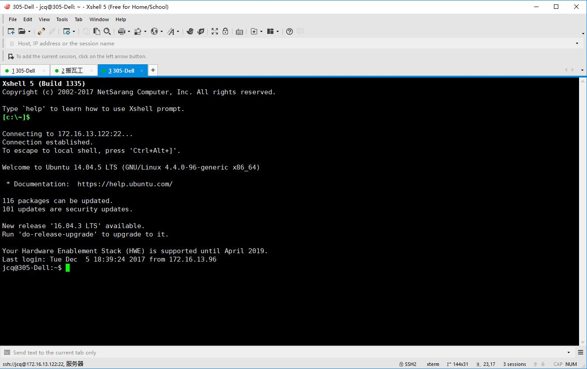
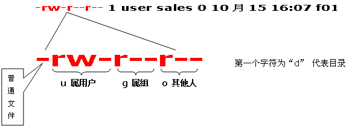
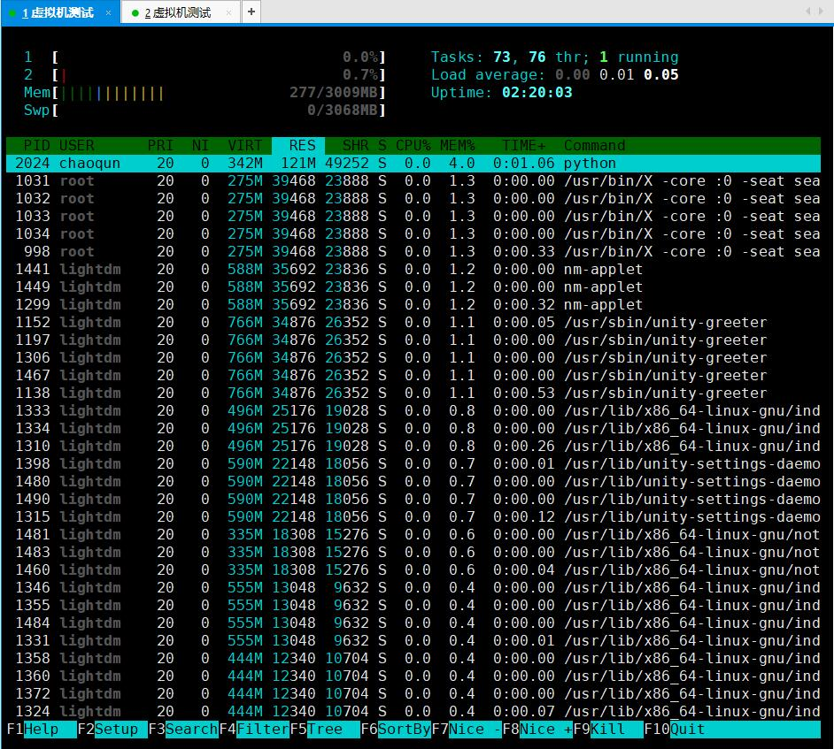
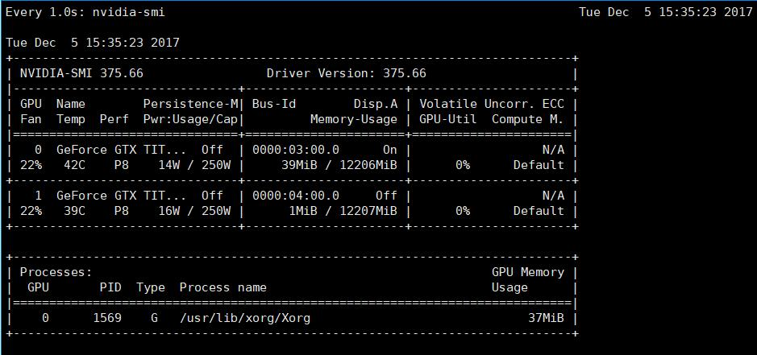

# linux相关的笔记

## [回首页](../README.md)

使用linux，肯定要多使用linux的`terminal`终端。而且很多时候使用`TensorFlow`都是搭建了一个GPU服务器供多个开发者共同使用，所以SSH远程连接过去更是常有的事，所以必须强迫自己学会应付没有显示界面的操作系统。

这里有一个比较不错的网站，叫做[Linux命令大全](http://man.linuxde.net/) 我也是写这篇文章时刚刚看到。那么，这里我就不再献丑了，只记录我在学习`TensorFlow`时经常使用的到的一些语句命令。

## SSH远程

配置linux服务器SSH远程访问的服务可以参考这篇博客:[如何在Ubuntu上开启SSH服务](http://blog.csdn.net/md521/article/details/52597398)。

远程这个不必强调重要性了，基本是连接服务器必须会的。

### Pytty

一个非常小且免费的ssh连接linux服务器的开源工具。[下载地址](http://www.putty.org/)

### xShell

一个很好用的远程连接linux终端的工具，商业付费，自用免费。[官网下载地址](https://www.netsarang.com/download/software.html)



### 终止当前命令

这里需要提一下，有的时候我们在命令行里正在运行的命令，特别费时，或者是不想继续执行这个命令，我们又几个快捷键可以使用。

``` shell
ctrl + c  # 结束脚本的继续执行
ctrl + d  #
ctrl + z  # 暂时放到后台
```

## 文件

```shell
cd    # 当前文件路径的跳转
ls    # 列出文件/目录 列表
ll    # 列出文件/目录 列表（详细 包含权限）
df -h # 列出磁盘信息
du -h # 查看个文件夹大小
mkdir # 创建文件夹
rm    # 删除文件夹
mv    # 移动文件/夹
```

### 修改文件权限 chmod

有的时候本地普通用户没有文件管理的权限，我们需要修改文件的使用权限。在UNIX系统家族里，文件或目录权限的控制分别以读取、写入、执行3种一般权限来区分，另有3种特殊权限可供运用。用户可以使用chmod指令去变更文件与目录的权限，设置方式采用文字或数字代号皆可。 

```shell
chmod(选项)(参数)

-c或——changes：效果类似“-v”参数，但仅回报更改的部分；
-f或--quiet或——silent：不显示错误信息；
-R或——recursive：递归处理，将指令目录下的所有文件及子目录一并处理；
-v或——verbose：显示指令执行过程；
--reference=<参考文件或目录>：把指定文件或目录的所属群组全部设成和参考文件或目录的所属群组相同；
<权限范围>+<权限设置>：开启权限范围的文件或目录的该选项权限设置；
<权限范围>-<权限设置>：关闭权限范围的文件或目录的该选项权限设置；
<权限范围>=<权限设置>：指定权限范围的文件或目录的该选项权限设置；

chmod u+x,g+w f01　　# 为文件f01设置自己可以执行，组员可以写入的权限
chmod u=rwx,g=rw,o=r f01
chmod 764 f01
chmod a+x f01　　    # 对文件f01的u,g,o都设置可执行属性

来自: http://man.linuxde.net/chmod
```

### 压缩、解压文件

`tar` 命令可以为linux的文件和目录创建压缩包。利用tar可以压缩文件，也可以在压缩包中修改文件。

```shell
tar(选项)(参数)

-A或--catenate：新增文件到以存在的备份文件；
-B：设置区块大小；
-c或--create：建立新的备份文件；
-C <目录>：这个选项用在解压缩，若要在特定目录解压缩，可以使用这个选项。
-d：记录文件的差别；
-x或--extract或--get：从备份文件中还原文件；
-t或--list：列出备份文件的内容；
-z或--gzip或--ungzip：通过gzip指令处理备份文件；
-Z或--compress或--uncompress：通过compress指令处理备份文件；
-f<备份文件>或--file=<备份文件>：指定备份文件；
-v或--verbose：显示指令执行过程；
-r：添加文件到已经压缩的文件；
-u：添加改变了和现有的文件到已经存在的压缩文件；
-j：支持bzip2解压文件；
-v：显示操作过程；
-l：文件系统边界设置；
-k：保留原有文件不覆盖；
-m：保留文件不被覆盖；
-w：确认压缩文件的正确性；
-p或--same-permissions：用原来的文件权限还原文件；
-P或--absolute-names：文件名使用绝对名称，不移除文件名称前的“/”号；
-N <日期格式> 或 --newer=<日期时间>：只将较指定日期更新的文件保存到备份文件里；
--exclude=<范本样式>：排除符合范本样式的文件。


tar -cvf log.tar log2012.log      # 仅打包，不压缩！
tar -zcvf log.tar.gz log2012.log  # 打包后，以 gzip 压缩
tar -jcvf log.tar.bz2 log2012.log # 打包后，以 bzip2 压缩
tar -ztvf log.tar.gz              # 查询tar包内有什么文件
tar -zxvf /opt/soft/test/log.tar.gz # 解压缩tar包
tar -zxvf /opt/soft/test/log30.tar.gz log2013.log # 解压tar包内部分文件

压　缩：tar -jcv -f filename.tar.bz2 要被压缩的文件或目录名称
查　询：tar -jtv -f filename.tar.bz2
解压缩：tar -jxv -f filename.tar.bz2 -C 欲解压缩的目录

来自: http://man.linuxde.net/tar
```

## 任务管理器

### top

系统自带的任务管理器，个人觉得不如htop好用，也可以查看CPU、内存等占用信息。

### htop

相较top命令，htop有更清晰明了的显示。[安装](https://www.zhihu.com/question/20167594/answer/25812005)起来也很简便。 

### nvidia-smi

如果你使用的服务器安装了NVIDIA显卡，并且配备了驱动，那么可以使用这条命令`nvidia-smi`查看运行状态。

也可以使用`watch -n 1 nvidia-smi`每秒钟刷新一次状态结果。 

## 文件传输

### ftp

比较经典的传输协议，可以直接查询相关教程。

### lrzsz

当在windows系统下使用xShell工具远程连接linux服务器时，lrzsz工具包可以比较方便的在服务器和本地之间传输文件，使用ssh协议。本地向服务器传文件是`rz`，然后会有文件选择工具出现。服务器向本地传输文件是`sz 文件名`，然后会让你选择本地保存路径。这个东西[需要自己安装](http://blog.csdn.net/ljxfblog/article/details/38396421)。

### 下载文件

`wget` 是linux的下载文件的命令。

```shell
wget http://www.linuxde.net/testfile.zip                            # 直下载文件
wget -O wordpress.zip http://www.linuxde.net/download.aspx?id=1080  # 下载文件另存为文件名
wget --limit-rate=300k http://www.linuxde.net/testfile.zip          # 限速下载
wget -c http://www.linuxde.net/testfile.zip                         # 支持断点续传下载
wget -b http://www.linuxde.net/testfile.zip                         # 后台下载

来自: http://man.linuxde.net/wget
```

## 系统

```shell
uname -a               # 查看内核/操作系统/CPU信息
head -n 1 /etc/issue   # 查看操作系统版本
cat /proc/cpuinfo      # 查看CPU信息
hostname               # 查看计算机名
lspci -tv              # 列出所有PCI设备
lsusb -tv              # 列出所有USB设备
lsmod                  # 列出加载的内核模块
env                    # 查看环境变量
```

## 资源

```shell
free -m                # 查看内存使用量和交换区使用量
df -h                  # 查看各分区使用情况
du -sh <目录名>        # 查看指定目录的大小
grep MemTotal /proc/meminfo   # 查看内存总量
grep MemFree /proc/meminfo    # 查看空闲内存量
uptime                 # 查看系统运行时间、用户数、负载
cat /proc/loadavg      # 查看系统负载
```

## 磁盘和分区

```shell
mount | column -t      # 查看挂接的分区状态
fdisk -l               # 查看所有分区
swapon -s              # 查看所有交换分区
hdparm -i /dev/hda     # 查看磁盘参数(仅适用于IDE设备)
dmesg | grep IDE       # 查看启动时IDE设备检测状况
```

## 网络

```shell
ifconfig               # 查看所有网络接口的属性
iptables -L            # 查看防火墙设置
route -n               # 查看路由表
netstat -lntp          # 查看所有监听端口
netstat -antp          # 查看所有已经建立的连接
netstat -s             # 查看网络统计信息
```

## 进程

```shell
ps -ef                 # 查看所有进程
top                    # 实时显示进程状态
htop                   # （需安装）实时显示进程状态
```

## 用户

```shell
w                         # 查看活动用户
id <username>             # 查看指定用户信息
last                      # 查看用户登录日志
cut -d: -f1 /etc/passwd   # 查看系统所有用户
cut -d: -f1 /etc/group    # 查看系统所有组
crontab -l                # 查看当前用户的计划任务
passwd username           # 修改用户密码
useradd -u userID username # 添加新用户
useradd -u 1001 user1
useradd - u userID -g groupId username # 添加用户，并指定用户组

userdel -r username       # 删除用户及其文件夹
groupadd -g groupID groupname   # 添加 group
gpasswd -a username groupname   # 添加用户到一个group
gpasswd -d username groupname   # 从组中删除一个用户

chown -R username foldername    # 修改文件夹所有者
chown -R .groupname foldername  # 修改文件夹所有组
```

## 服务

```shell
chkconfig --list              # 列出所有系统服务
chkconfig --list | grep on    # 列出所有启动的系统服务
```

## 后台执行命令
``` shell
nohup [command] > filename 2>&1 &
```
其中，command 是你原本需要执行的命令，filename是你想要把原程序输出写出到的文件，文件所在的文件夹路径必须已经存在，该输出文件不存在会自动新建。

# Reference

- [Linux命令大全](http://man.linuxde.net/)
- [如何在Ubuntu上开启SSH服务](http://blog.csdn.net/md521/article/details/52597398)
- [Putty](http://www.putty.org/)
- [xShell](https://www.netsarang.com/download/software.html)

### [回首页](../README.md)
