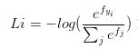

# Softmax Regression
### [回首页](../README.md)

 > Softmax Regression是Logistic回归的推广，Logistic回归是处理二分类问题的，而Softmax Regression是处理多分类问题的。Logistic回归是处理二分类问题的比较好的算法，具有很多的应用场合，如广告计算等。Logistic回归利用的是后验概率最大化的方式去计算权重。

也就是我们希望得到的是每一种分类的可能性，比如有80%的可能性是A，15%的可能性是B，只有5%的可能性是C。所有可能性的情况加起来是1 。这样子，就不像单纯的逻辑回归那么强硬。总之，`SoftMax`分类器输出的是概率。

`Softmax Regressions` 有两步：
1. 分别将输入数据属于某一类的证据相加；
2. 将这个证据转换为概率。

## Loss 损失函数
交叉熵损失（`cross-entropy loss`）

# 参考链接-致谢
- [MNIST For ML Beginners](https://www.tensorflow.org/get_started/mnist/beginners?hl=zh-cn#softmax_regressions)
- [ 简单易学的机器学习算法——Softmax Regression](http://blog.csdn.net/google19890102/article/details/41594889)
- [交叉熵代价函数(损失函数)及其求导推导](http://blog.csdn.net/jasonzzj/article/details/52017438)
### [回首页](../README.md)
